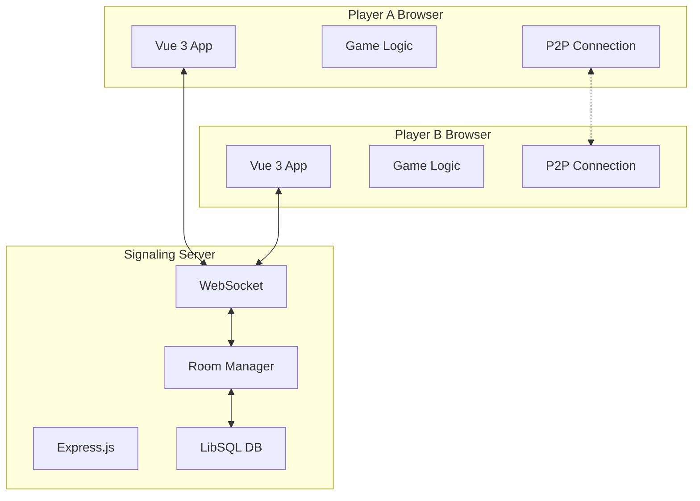

# Strateturn - Architecture Guide

> **Quick Start**: A P2P multiplayer strategy game with hybrid server-client architecture, built with Vue 3, WebRTC, and modern web technologies.

## 🏗️ Architecture Overview

Strateturn uses a **hybrid P2P + server architecture** that balances real-time performance with reliable connection management:

- **Frontend**: Vue 3 + TypeScript + Pinia for reactive game UI
- **Backend**: Express.js + WebSocket for signaling and room management  
- **P2P Layer**: WebRTC for direct player-to-player game data
- **Database**: LibSQL for lightweight data persistence



## 🎯 Core Principles

### **Event-Driven Architecture**
- Components communicate through events, not direct coupling
- WebSocket messages route through type-based handlers
- Vue components use props down, events up pattern

### **Type-Safe Development**
- Comprehensive TypeScript throughout frontend and backend
- Interfaces define all data structures and API contracts
- Runtime validation matches TypeScript types

### **Reactive State Management**
- Pinia stores manage global application state
- Vue 3 Composition API for component-level reactivity
- Automatic UI updates through reactive references

### **Real-Time Communication**
- WebSocket for initial signaling and room coordination
- WebRTC P2P for low-latency game data exchange
- Automatic reconnection and error recovery

## 📦 System Components

### **Frontend Architecture**

#### **Game Logic Module** (`frontend/src/game/logic/`)
Core game mechanics with clean separation of concerns:
- **GameStateMachine**: Orchestrates game flow with type-safe state transitions
- **GameStateManager**: Manages 10x10 board and game state
- **MovementValidator**: Validates moves according to game rules
- **CombatResolver**: Handles piece interactions and combat
- **GameEndAnalyzer**: Detects victory conditions

#### **State Management** (`frontend/src/stores/`)
Pinia stores for reactive state:
- **Player Store**: Identity, roles, and room association with localStorage persistence
- **Multiplayer Store**: WebSocket connection and P2P coordination

#### **Component System** (`frontend/src/components/`)
Vue 3 components with Composition API:
- **GameBoard**: Main game interface with interaction handling
- **BoardCell**: Individual cell rendering with conditional display
- **GamePiece**: Piece visualization with state-based styling

### **Backend Architecture**

#### **Express Server** (`backend/src/index.ts`)
HTTP and WebSocket server:
- Middleware stack for JSON parsing, CORS, static files
- WebSocket server for real-time signaling
- Health monitoring endpoint

#### **Room Manager** (`backend/src/RoomManager.ts`)
Game room lifecycle management:
- Room creation and player assignment (max 2 players)
- Automatic cleanup of empty rooms
- In-memory storage with Map-based collections

#### **Message Handlers**
WebSocket message processing:
- `join_room`: Player room joining with validation
- `game_state_update`: State synchronization across players
- Type-based message routing with error handling

### **Communication Layer**

#### **WebSocket Service** (`frontend/src/services/WebSocketService.ts`)
Client-side WebSocket management:
- Promise-based connection with automatic reconnection
- Event-driven message routing to components
- Connection state monitoring and error recovery

#### **P2P Connection Manager** (`frontend/src/game/p2p/P2PConnection.ts`)
WebRTC peer-to-peer communication:
- Connection lifecycle management with STUN servers
- Message protocol with validation and queuing
- Git-based state synchronization for conflict resolution

## 🚀 Getting Started

### **Development Setup**
```bash
# Install dependencies
npm install  # Root dependencies
cd frontend && npm install
cd ../backend && npm install

# Start development servers
npm run dev  # Starts both frontend and backend
```

### **Key Development Concepts**

#### **Adding New Game Features**
1. **Game Logic**: Extend `GameStateMachine` with new states/events
2. **Validation**: Add rules to `MovementValidator` or `CombatResolver`
3. **UI**: Create Vue components following composition patterns
4. **State**: Add reactive state to appropriate Pinia store

#### **WebSocket Message Types**
```typescript
// Client to Server
{ type: 'join_room', roomId: string, playerId: string }
{ type: 'game_state_update', roomId: string, data: GameState }

// Server to Client  
{ type: 'room_joined', data: { roomId: string, playerId: string } }
{ type: 'game_state_sync', data: GameState }
{ type: 'error', data: { message: string } }
```

#### **P2P Message Protocol**
```typescript
interface P2PMessage {
  type: 'state_change' | 'git_commit' | 'sync_request' | 'sync_response'
  payload: {
    playerId: string
    timestamp: number
    gameState?: GameState
    commitHash?: string
  }
}
```

## 🔧 Development Patterns

### **State Management Pattern**
```typescript
// Pinia store with reactive state
export const usePlayerStore = defineStore('player', () => {
  const playerRole = ref<'red' | 'blue'>('red')
  const currentRoomId = ref<string | null>(null)
  
  // Computed properties for derived state
  const isRedPlayer = computed(() => playerRole.value === 'red')
  
  // Actions for state mutations
  const switchRole = () => {
    playerRole.value = playerRole.value === 'red' ? 'blue' : 'red'
  }
  
  return { playerRole, currentRoomId, isRedPlayer, switchRole }
})
```

### **Vue Component Pattern**
```typescript
// Composition API with TypeScript
interface Props {
  gameState: GameState
  currentPlayer: PlayerRole
}

const props = defineProps<Props>()
const emit = defineEmits<{
  pieceMove: [from: Position, to: Position, piece: Piece]
}>()

// Local reactive state
const selectedPiece = ref<Piece | null>(null)

// Computed properties
const boardCells = computed(() => 
  generateBoardCells(props.gameState)
)
```

### **Error Handling Pattern**
```typescript
// Service with error recovery
try {
  await wsService.connect()
  connected.value = true
} catch (error) {
  console.error('Connection failed:', error)
  // Automatic retry with exponential backoff
  attemptReconnect()
}
```

## 📚 Key Files for Development

### **Frontend Entry Points**
- `frontend/src/main.ts` - Application bootstrap
- `frontend/src/App.vue` - Root component
- `frontend/src/router/index.ts` - Vue Router configuration

### **Game Logic Core**
- `frontend/src/game/logic/GameStateMachine.ts` - Main game orchestration
- `frontend/src/game/types/` - TypeScript type definitions
- `frontend/src/stores/` - Global state management

### **Backend Core**
- `backend/src/index.ts` - Server entry point
- `backend/src/RoomManager.ts` - Room management logic
- `backend/src/types.ts` - Shared type definitions

### **Configuration**
- `frontend/vite.config.ts` - Frontend build configuration
- `backend/tsconfig.json` - Backend TypeScript configuration
- `package.json` - Project scripts and dependencies

## 🧪 Testing Strategy

### **Unit Testing**
- Game logic validation and state transitions
- Vue component behavior and rendering
- Pinia store actions and computed properties

### **Integration Testing**
- WebSocket message flow between client and server
- P2P connection establishment and data exchange
- Room management and player coordination

### **Development Commands**
```bash
npm test          # Run all tests
npm run test:ui   # Interactive test UI
npm run build     # Production build
npm run preview   # Preview production build
```

## 🔗 Related Documentation

- **[Requirements](./REQUIREMENTS.md)** - Business requirements and game rules
- **[PRD](./PRD.md)** - Product requirements and specifications
- **[Contributing](../CONTRIBUTING.md)** - Development guidelines and workflow
