# Strateturn - Architecture Document

## Overview

Strateturn is a configurable, browser-based strategy game that enables families, friends, and teachers to play thematic variants of Stratego-like games. The architecture is built around innovative Git-based P2P synchronization, YAML-configurable game rules, and WebRTC for direct client communication.

## Core Principles

- **Local-First**: Game state always buffered locally in browser
- **P2P-First**: Direct communication between clients via WebRTC
- **Git-Inspired**: Versioning and synchronization using Git semantics
- **Declarative**: Complete game logic configurable via YAML
- **URL-Based State**: Game state transported via URL for shareability

## System Architecture

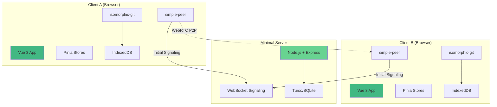

## Technology Stack

### Frontend
- **Framework**: Vue 3 with Composition API
- **State Management**: Pinia
- **Routing**: Vue Router with URL-based state
- **Build Tool**: Vite
- **Language**: TypeScript

### Libraries
- **Git Operations**: isomorphic-git (~200KB)
- **P2P Communication**: simple-peer (~25KB)
- **YAML Parsing**: js-yaml (~45KB)
- **Persistence**: IndexedDB (native)

### Backend (Minimal)
- **Runtime**: Node.js
- **Framework**: Express
- **Database**: SQLite with Turso (edge replicas)
- **WebSockets**: Native WebSocket API

## Component Architecture

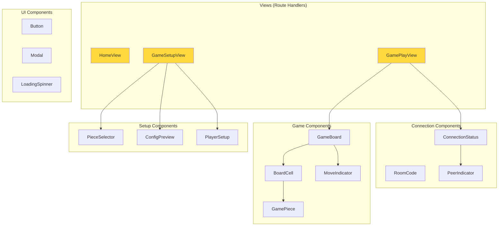

## State Management Architecture

### Pinia Stores

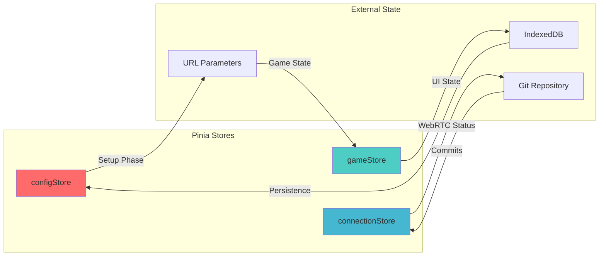

### Store Responsibilities

**configStore** (Setup Phase):
- Current YAML configuration being edited
- Validation state and errors
- Template loading and management
- Config export for room creation

**gameStore** (Gameplay Phase):
- Selected pieces and valid moves
- Animation states
- UI interaction state
- Temporary visual feedback

**connectionStore** (Always Active):
- WebRTC connection status
- Peer management
- Message sending/receiving
- Room management

## Git-Based P2P Protocol

### Commit-Per-Move Architecture

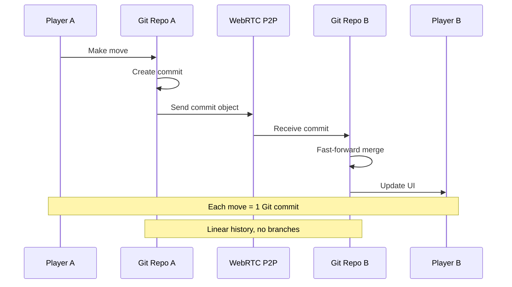

### Repository Structure

```
/game-repo/
├── gamestate.json    # Current game state (board, pieces, turn)
├── config.yaml       # Immutable game configuration
├── moves.log          # Human-readable move history (optional)
└── .git/             # Git metadata (managed by isomorphic-git)
```

### P2P Message Types

```typescript
type P2PMessage = 
  | { type: 'git_push', commit: CommitObject, gamestate: GameState }
  | { type: 'sync_request', last_known_hash: string }
  | { type: 'sync_response', commits: CommitObject[] }
  | { type: 'reconnect', player_id: string }
  | { type: 'game_end', reason: 'victory' | 'surrender' | 'disconnect' }
```

## Game Configuration System

### YAML Schema

```yaml
game:
  name: "Klassisches Stratego"
  board:
    width: 10
    height: 10
    obstacles: 
      - {x: 2, y: 4, width: 2, height: 2, type: "lake"}
  
  players:
    - name: "Rot"
      pieces:
        - rank: 10, name: "Marschall", count: 1, movement: 1
        - rank: 2, name: "Aufklärer", count: 8, movement: "unlimited"
        - rank: 0, name: "Bombe", count: 6, movement: 0
        - rank: -1, name: "Fahne", count: 1, movement: 0
  
  combat_rules:
    - piece: "Spion", defeats_additionally: ["Marschall"]
    - piece: "Mineur", defeats_additionally: ["Bombe"]
    - piece: "Bombe", defeats_all_except: ["Mineur"]
```

### Configuration Flow

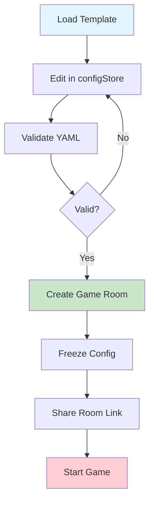

## WebRTC Signaling Architecture

### Minimal Server Design

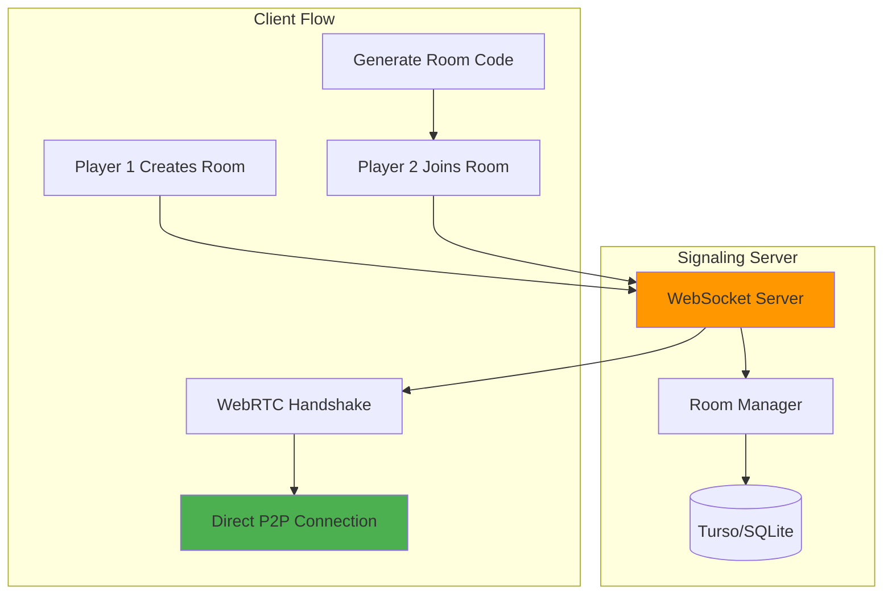

### Signaling Protocol

1. **Room Creation**: Player 1 sends game config to server
2. **Room Code Generation**: Server creates unique room ID (30s TTL)
3. **Room Joining**: Player 2 connects with room code
4. **WebRTC Handshake**: Server facilitates offer/answer exchange
5. **P2P Established**: Server connection closes, direct P2P begins

## Data Persistence Strategy

### Client-Side Storage

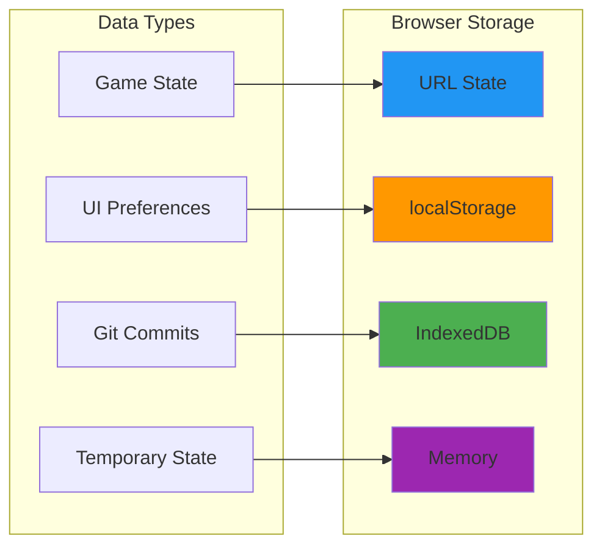

**Storage Allocation**:
- **URL**: Current game state, room ID, player ID, turn number
- **IndexedDB**: Git repository, commit history, game configurations
- **localStorage**: UI preferences, last room codes, player names
- **Memory**: Animation states, WebRTC connections, temporary UI state

### Server-Side Storage (Future)

- **Turso/SQLite**: Shared game configurations, room metadata
- **No Game State**: Server never stores actual game progress
- **Edge Replicas**: Low-latency access worldwide

## Security Considerations

### Git-Based Tamper Evidence

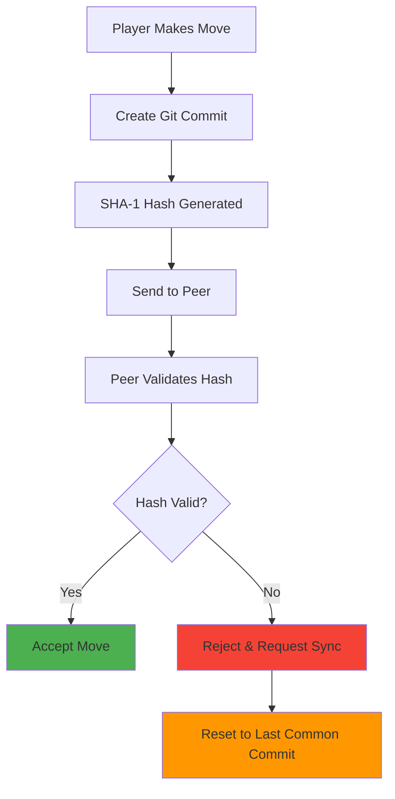

### Cheating Prevention

- **Cryptographic Hashes**: Every move creates tamper-evident commit
- **Linear History**: No branches, only fast-forward merges
- **Peer Validation**: Both clients validate all moves
- **Conflict Resolution**: Automatic reset on hash mismatch
- **No Server Trust**: Game logic runs entirely client-side

## Performance Considerations

### Bundle Size Optimization

| Component | Size | Justification |
|-----------|------|---------------|
| Vue 3 + Pinia | ~50KB | Core framework, unavoidable |
| isomorphic-git | ~200KB | Critical for P2P sync, no alternatives |
| simple-peer | ~25KB | WebRTC abstraction, much smaller than alternatives |
| js-yaml | ~45KB | YAML parsing, standard library |
| **Total** | **~320KB** | Acceptable for feature richness |

### Runtime Performance

- **Local-First**: No server round-trips during gameplay
- **IndexedDB**: Persistent storage without blocking main thread
- **WebRTC**: Direct P2P, minimal latency
- **Git Commits**: Incremental, only changed data

## Deployment Architecture

### Frontend Deployment

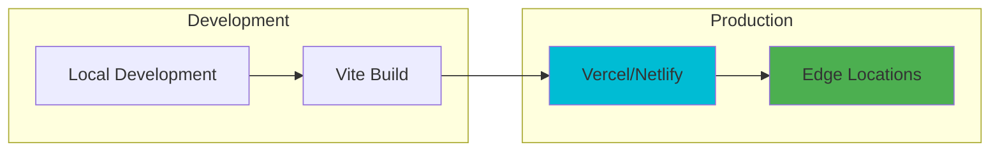

### Backend Deployment

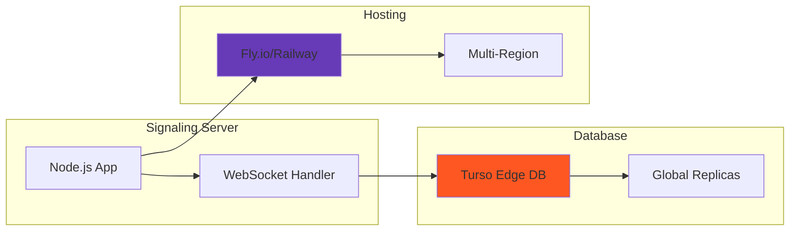

## Error Handling & Resilience

### Connection Failures

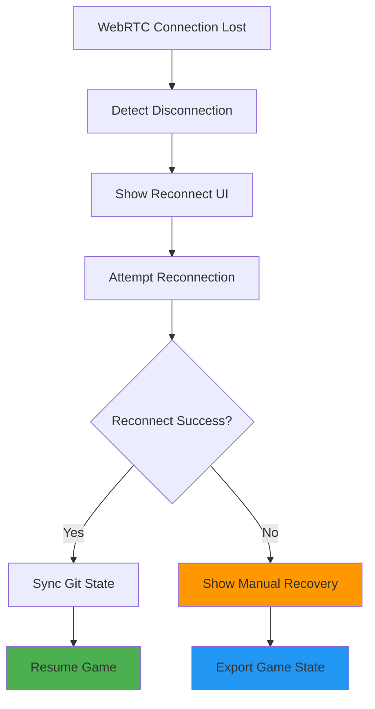

### State Synchronization Conflicts

1. **Detection**: SHA-1 hash mismatch between peers
2. **Resolution**: Reset both clients to last common commit
3. **Recovery**: Manual replay of conflicting moves
4. **Prevention**: Atomic commits, fast-forward only merges

## Future Architecture Considerations

### Scalability

- **Multi-Player Games**: Extend P2P mesh for >2 players
- **Tournament Mode**: Central coordination server
- **Spectator Mode**: Read-only P2P connections

### Enhanced Features

- **Real-Time Chat**: Additional WebRTC data channel
- **Voice Communication**: WebRTC audio channel
- **Screen Sharing**: WebRTC video for game analysis

### Configuration Sharing

- **Community Configs**: Server-side configuration marketplace
- **Version Control**: Git-based configuration versioning
- **Collaborative Editing**: Real-time YAML editing

## Conclusion

The Strateturn architecture represents an innovative approach to browser-based gaming, combining:

- **Git-based state management** for tamper-evident gameplay
- **P2P-first communication** for minimal server dependency
- **YAML-configurable rules** for maximum flexibility
- **URL-based state** for shareability and bookmarking

This architecture enables a new class of configurable, decentralized games while maintaining simplicity for end users and developers.
